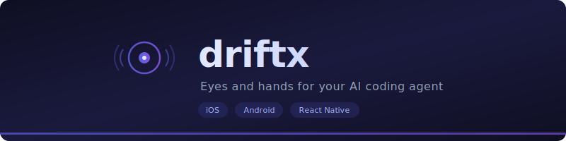

<p align="center">
  
</p>

<p align="center">
  <a href="https://www.npmjs.com/package/driftx"></a>
  <a href="https://github.com/nomanr/driftx/blob/main/LICENSE"></a>
  <a href="https://www.npmjs.com/package/driftx"></a>
  
</p>

<p align="center">
  Give your AI coding agent eyes and hands for your mobile app.
</p>

---

driftx lets AI agents see your app's screen, tap buttons, type text, swipe, and compare against designs — on iOS simulators and Android emulators. It works with Claude Code, Cursor, Gemini CLI, Codex, and any agent that can run shell commands.

## How It Works

You tell your agent "test the login flow" or "compare this screen against the Figma mockup." The agent uses driftx to capture screenshots, inspect the component tree, find and tap buttons by their text or testID, type into fields, swipe through lists, and run visual comparisons — all without you touching a device.

The skill triggers automatically. When you ask your agent to interact with your app, it knows to reach for driftx. No manual invocation needed.

## Installation

First, install the CLI globally:

```bash
npm install -g driftx
```

Then set up the skill for your coding agent:

### Claude Code

```bash
driftx setup-claude
```

Restart Claude Code. The agent now has the `driftx` skill.

### Cursor

In Cursor Agent chat:

```
/add-plugin driftx
```

Or search for "driftx" in the plugin marketplace.

### Gemini CLI

```bash
gemini extensions install https://github.com/nomanr/driftx
```

### Codex

Tell Codex:

```
Fetch and follow instructions from https://raw.githubusercontent.com/nomanr/driftx/main/.codex/INSTALL.md
```

### Other Agents

driftx is a standard CLI. Any agent that can run shell commands can use it. Add this to your agent's system prompt or rules:

```
You have access to `driftx` for mobile app testing:
- driftx capture -o screenshot.png   — capture a screenshot
- driftx inspect --json              — get the component tree
- driftx tap "Button Text"           — tap by text, testID, or name
- driftx type input-id "text"        — type into a field
- driftx swipe up                    — swipe gestures
- driftx compare --design design.png --format json — compare against a design
Always capture a screenshot after interactions to verify the result.
```

### Verify Installation

```bash
driftx doctor
```

This checks that your environment is ready — Metro, adb, xcrun, simulators.

## Prerequisites

- **Metro bundler** running (`npx react-native start`) for tree inspection and tap resolution
- **Android**: `adb` available, emulator booted
- **iOS**: `xcrun simctl` available, simulator booted

## What Your Agent Can Do

**See the app** — Capture screenshots, inspect the React Native component tree, get element names, testIDs, text content, and positions.

**Interact with the app** — Tap buttons, type text, swipe, navigate back, open deep links. Targets resolve automatically by testID, component name, or visible text.

**Compare against designs** — Pixel-diff against Figma exports or mockups. Run accessibility audits. Detect layout regressions between builds.

## Commands

### Capture & Compare

```bash
driftx capture -o screenshot.png
driftx compare --design mockup.png --format json
driftx compare --design mockup.png --with a11y --format json
driftx compare --baseline --format json
```

### Inspect

```bash
driftx inspect --json
```

Returns component names, testIDs, text content, and bounds.

### Interact

```bash
driftx tap "Login"                        # tap by text
driftx tap login-btn                      # tap by testID
driftx tap 150,300 --xy                   # tap by coordinates
driftx type email-input "user@test.com"   # type into field
driftx swipe up                           # swipe gesture
driftx swipe down --distance 200          # custom distance
driftx go-back                            # back button
driftx open-url "myapp://profile/123"     # deep link
```

### Utilities

```bash
driftx devices       # list simulators/emulators
driftx doctor        # check prerequisites
driftx init          # generate .driftxrc.json
```

## Global Flags

| Flag | Description |
|------|-------------|
| `-d, --device <id>` | Device ID or name (picker shown if multiple devices booted) |
| `--bundle-id <id>` | iOS bundle identifier (auto-detected from Metro) |
| `--verbose` | Debug logging |
| `--format <type>` | `terminal`, `markdown`, or `json` |
| `--copy` | Copy output to clipboard |

## Platform Support

| Platform | Emulator/Simulator | Physical Device |
|----------|-------------------|-----------------|
| Android  | Supported         | Not yet         |
| iOS      | Supported         | Not yet         |

## How It Works Under the Hood

**Tap resolution** uses a 4-tier fallback chain:
1. CDP fiber tree — React Native component names and text
2. XCUITest companion hierarchy — iOS accessibility labels with real screen bounds
3. Accessibility element query — XCUITest `/find` endpoint
4. Fiber measurement — `stateNode.measureInWindow()` for elements without a11y labels

**iOS companion** is a pre-built XCUITest server that auto-launches on the simulator. Ships pre-built in the npm package — no Xcode build step on install.

**Visual analysis** compares screenshots pixel-by-pixel against design images, runs accessibility checks on the component tree, and detects layout regressions between builds.

## Configuration

```bash
driftx init
```

Or create `.driftxrc.json` manually:

```json
{
  "platform": "react-native",
  "metroPort": 8081,
  "threshold": 0.1,
  "diffThreshold": 5
}
```

## Updating

driftx notifies you when a new version is available:

```bash
npm install -g driftx
```

## Development

```bash
npm install
npm run dev          # watch mode
npm test             # run tests
npm run build:ios    # rebuild iOS companion after Swift changes
```

## License

[MIT](LICENSE)
